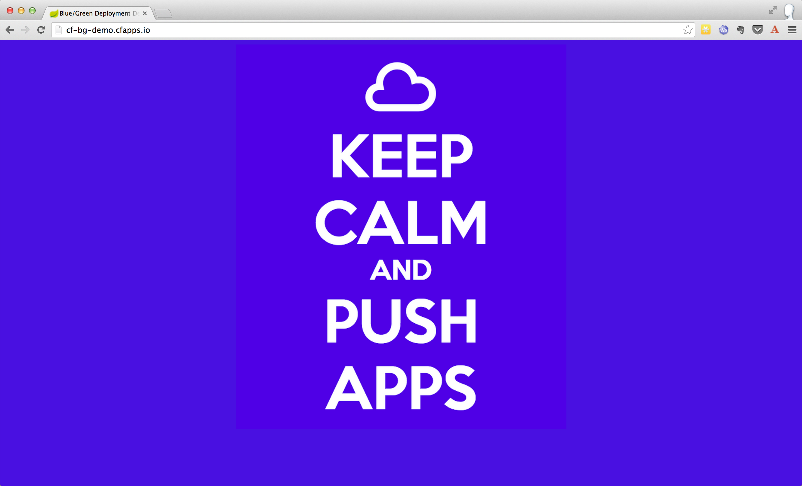

= cf-bg-demo

Demonstrate http://www.mattstine.com/2013/07/10/blue-green-deployments-on-cloudfoundry/[Blue-Green Deployments] on Cloud Foundry with this simple (one Groovy file, one HTML file) Spring Boot CLI application!

== Running Locally

* Install the http://docs.spring.io/spring-boot/docs/current-SNAPSHOT/reference/htmlsingle/#getting-started-installing-the-cli[latest Spring Boot CLI].
* Run:

----
$ spring run app.groovy
----

== Running on Cloud Foundry

The application requires the latest version of the Java Buildpack, so we'll use that from GitHub.

----
$ cf push -m 512M -b https://github.com/cloudfoundry/java-buildpack cf-scale-boot
----

== Doing a Blue-Green Demo

This application leverages the colors blue and green to demonstrate the dynamic routing and load balancing capabilities of Cloud Foundry in a Blue-Green Deployment Scenario.

=== Steps:

. Push the application as-is, with +blue+ appended to the application name:
+
----
$ cf push -m 512M -b https://github.com/cloudfoundry/java-buildpack cf-bg-demo-blue
----

. Map a ``zero downtime'' route to the application:
+
----
cf map-route cf-bg-demo-blue cfapps.io -n cf-bg-demo
----
+
Visit your application in the browser using your zero downtime route to see that it is working.

. Modify +app.groovy+ to use the color green (line 8):
+
----
model['color'] = 'green'
----

. Push the modified application, with +green+ appended to the application name:
+
----
$ cf push -m 512M -b https://github.com/cloudfoundry/java-buildpack cf-bg-demo-green
----

. Map the ``zero downtime'' route to the modified application:
+
----
cf map-route cf-bg-demo-green cfapps.io -n cf-bg-demo
----
+
Visit your application in the browser using your zero downtime route to see that the platform is load balancing between the two instances.

. Un-map the ``zero downtime'' route from the original application:
+
----
cf unmap-route cf-bg-demo-blue cfapps.io -n cf-bg-demo
----
+
Visit your application in the browser using your zero downtime route to see that only the modified application is now in play.

== What you get:

